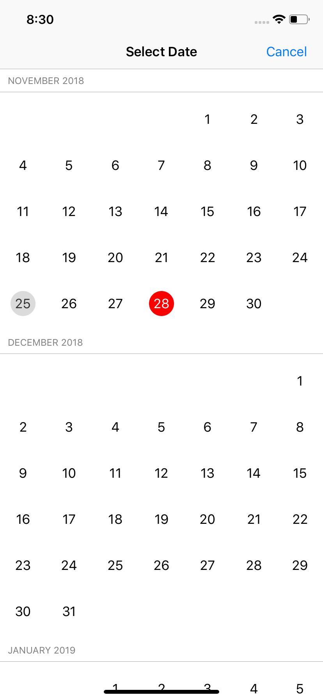

# Titanium Calendar

An easy to use iOS modal calendar for selecting dates. Based on the awesome [PDTSimpleCalendar](https://github.com/jivesoftware/PDTSimpleCalendar) library.



## Features

1. Show the calendar modally
2. Show the calendar in a view of your desire

## Examples

###  Calendar Dialog (modally)

```js
var TiCalendar = require('ti.calendar');

var win = Ti.UI.createWindow({
  backgroundColor: '#fff'
});

var button = Ti.UI.createButton({
  title: 'Show calendar'
});

win.add(button);

const calendar = TiCalendar.createCalendar({
  // All optional
  title: L('Select Date', 'Select Date'),
  value: new Date(),
  circleBackgroundColor: '#fff',
  circleSelectedBackgroundColor: '#f00',
  textColor: '#000',
  textSelectedColor: '#fff',
  todayTextColor: '#333',
  todayCircleBackgroundColor: '#dbdbdb'
});

calendar.addEventListener('change', function() {
  calendar.hide();
});

button.addEventListener('click', function() {
  calendar.show();
});

win.open();
```

### Calendar View

```js
var TiCalendar = require('ti.calendar');

var selectedDate = new Date();

var win = Ti.UI.createWindow({
  title: 'Select Date',
  backgroundColor: '#fff'
});

var button = Ti.UI.createButton({
  title: 'Show calendar'
});

win.add(button);

button.addEventListener('click', function() {
  const calendar = TiCalendar.createCalendarView({
    title: 'Select Date',
    value: selectedDate,
    //firstValue: new Date(2021, 11, 10),
    //maxValue: new Date(2022, 2, 2)
    circleBackgroundColor: '#fff',
    circleSelectedBackgroundColor: '#f00',
    textColor: '#000',
    textSelectedColor: '#fff',
    todayTextColor: '#333',
    todayCircleBackgroundColor: '#dbdbdb'
  });

  calendar.addEventListener('change', function(e) {
    Ti.API.warn('Selected date: ' + e.date);
    selectedDate = e.date;
  });

  var win2 = Ti.UI.createWindow({
    title: 'Select Date',
    backgroundColor: '#fff'
  });

  win2.add(calendar);

  nav.openWindow(win2);
});

var nav = Ti.UI.createNavigationWindow({
  window: win
});

nav.open();
```

## License

MIT

## Author

Hans Knöchel
